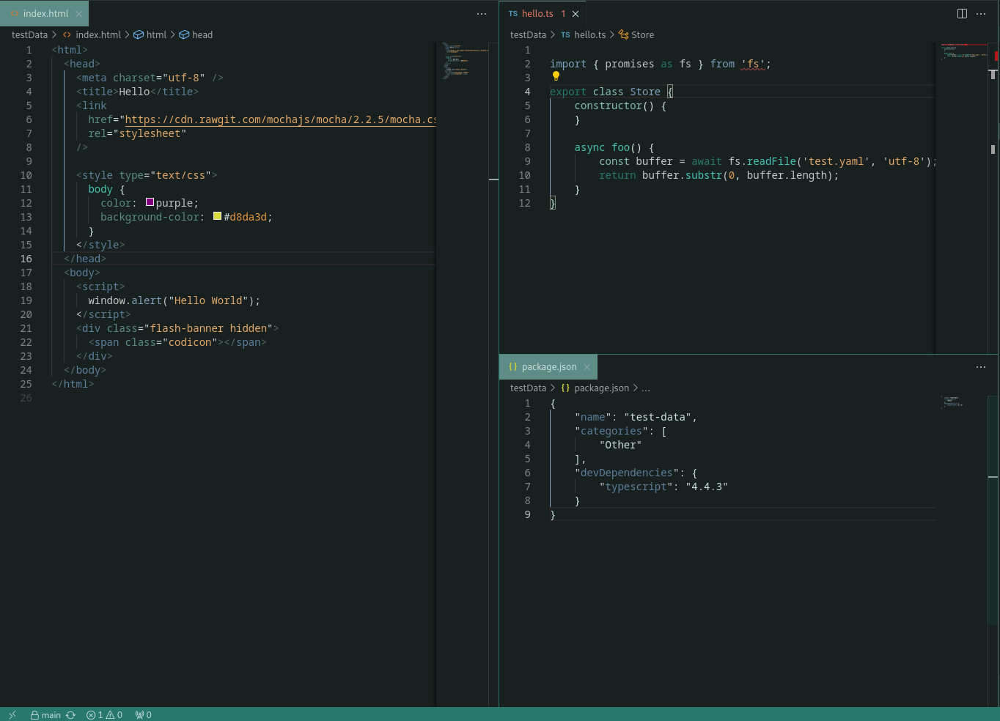
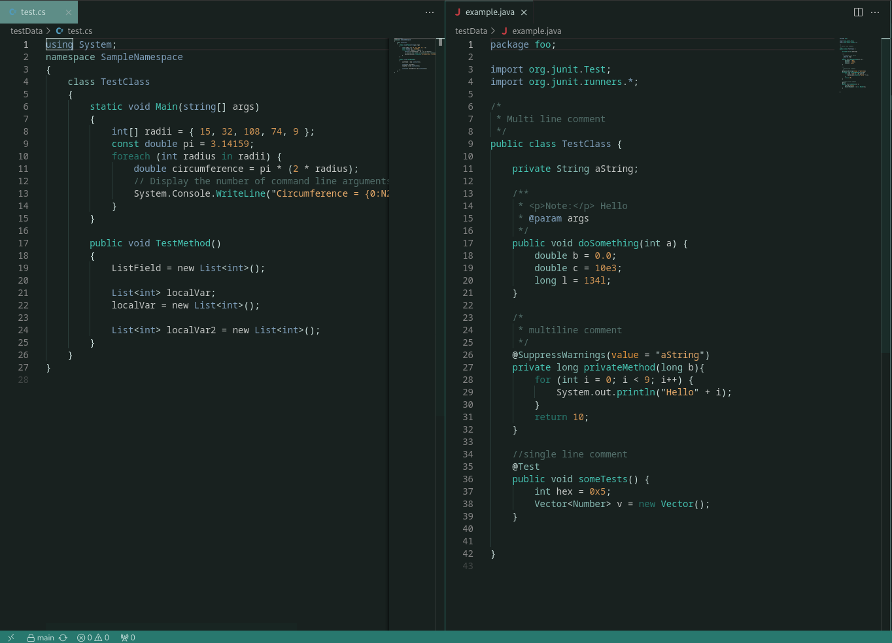
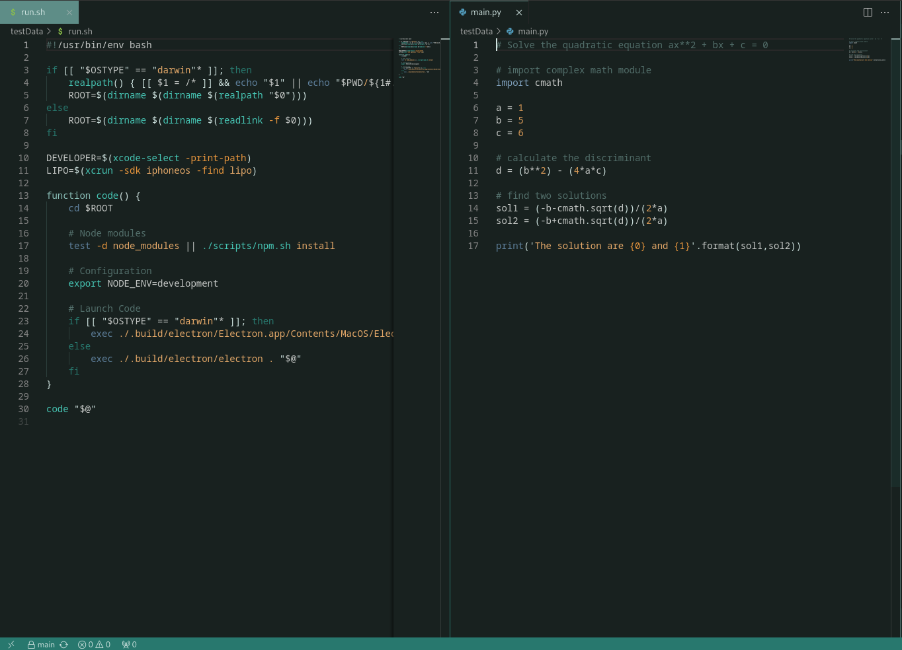

<h3 align="center">
	 
</h3>

    

# Dark Petrol for VS Code

Enjoy a dark background with subtle variations of dark petrol hues. Personally crafted to create a comfortable coding environment (initially for me, but hopefully for you too).

## Preview

 

 

Screenshots taken using example repository: https://github.com/microsoft/vscode-theme-tester